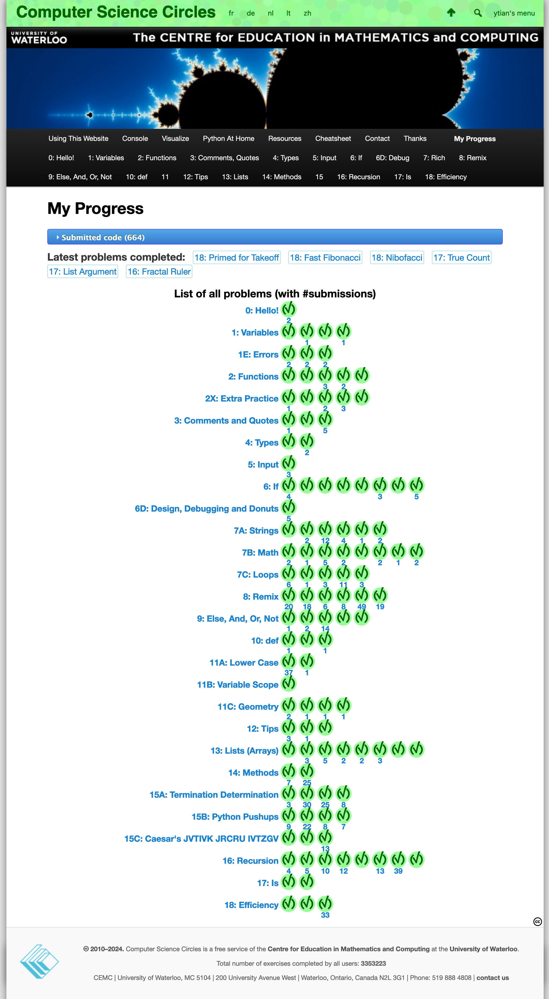

>There is nothing so confining as the prisons of our own perceptions. -William Shakespeare

theoretical basis: http://www.catb.org/~esr/faqs/hacker-howto.html

## STATIONS
### Python
- [x] http://cscircles.cemc.uwaterloo.ca

### Go
- [ ] https://go.dev/tour/list
- [ ] https://go.dev/doc/effective_go
### C
- [ ] https://beej.us/guide/bgc/html/split/
### C++
- [ ] https://www.learncpp.com
### Perl
### Lisp
### Unix

### Network Programming
- [ ] https://beej.us/guide/bgnet/html/split/
